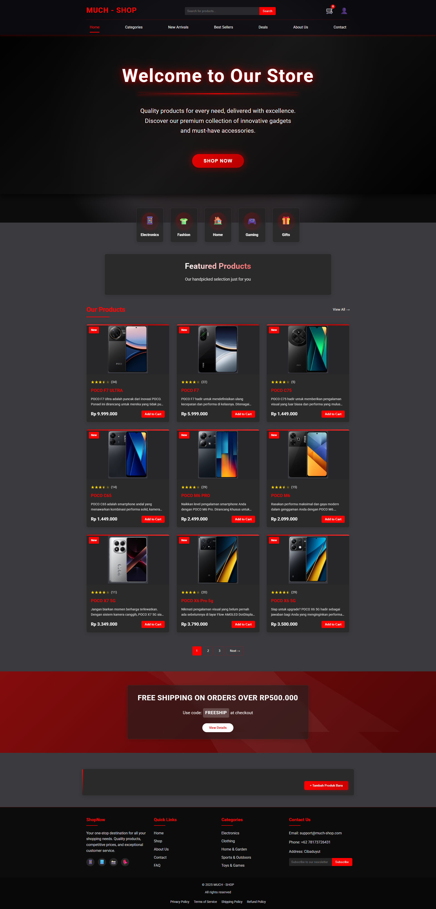

# 🚀 Cloud Computing UTS - Modern E-commerce Frontend 


<p align="center">
  
</p>

> ✨ Sebuah aplikasi e-commerce modern dengan UI elegan, efek visual menawan, dan fungsionalitas lengkap.

## 📋 Daftar Isi

- [🚀 Fitur Utama](#-fitur-utama)
- [🛠️ Teknologi yang Digunakan](#️-teknologi-yang-digunakan)
- [⚙️ Instalasi](#️-instalasi)
- [🏗️ Struktur Project](#️-struktur-project)
- [📚 Arsitektur Aplikasi](#-arsitektur-aplikasi)

## 🚀 Fitur Utama

- ✨ **UI Modern** - Desain modern dengan efek glassmorphism dan gradien
- 🖼️ **Modal Produk** - Tampilan detail produk dalam modal fullscreen
- 📝 **Manajemen Produk** - Tambah dan lihat produk dengan mudah
- 🔄 **Integrasi Backend** - Terhubung dengan backend melalui RESTful API
- 🌊 **Animasi Elegan** - Background animasi yang menarik dengan efek pergerakan
- 🎨 **Tema Elegan** - Kombinasi warna hitam dan merah dengan sentuhan neon untuk tampilan premium
- 📱 **Responsive Design** - Tampilan yang menyesuaikan dengan berbagai ukuran layar
- 🔄 **CI/CD Pipeline** - Deployment otomatis ke AWS EC2

## 🛠️ Teknologi yang Digunakan

### Frontend
- **React** - Library JavaScript untuk membangun user interface
- **CSS3** - Styling dengan CSS murni, termasuk animasi dan efek khusus
- **Axios** - HTTP client untuk API requests
- **Webpack** - Module bundler untuk aplikasi modern

### CI/CD & Deployment
- **GitHub Actions** - Otomatisasi workflow CI/CD
- **AWS EC2** - Hosting aplikasi frontend
- **Nginx** - Web server untuk serving aplikasi

## ⚙️ Instalasi

### Prasyarat
- Node.js (versi 14.x atau lebih tinggi)
- npm (biasanya disertakan dengan Node.js)
- Git

### Langkah Instalasi

1. **Clone repository**
   ```bash
   git clone https://github.com/MuchTrie/Cloud-Computing_UTS-Frontend.git
   cd Cloud-Computing_UTS-Frontend
   ```

2. **Install dependencies**
   ```bash
   npm install
   ```

3. **Konfigurasi backend URL**
   - Buka file `src/App.js`
   - Sesuaikan URL backend pada axios request:
     ```javascript
     const response = await axios.get('http://localhost:3000/api/products');
     ```

4. **Jalankan aplikasi untuk development**
   ```bash
   npm start
   ```

5. **Build untuk production**
   ```bash
   npm run build
   ```

Aplikasi akan berjalan di `http://localhost:5000` dalam mode development.

## 🏗️ Struktur Project

```
Frontend/
├── package.json         # Dependencies dan scripts
├── webpack.config.js    # Konfigurasi bundler
├── public/
│   └── index.html       # Entry point HTML
├── src/
│   ├── App.js           # Komponen utama aplikasi
│   ├── index.js         # Entry point React
│   ├── components/      # Komponen UI reusable
│   │   ├── AnimatedBackground.js   # Background animasi
│   │   ├── Footer.js    # Footer website
│   │   ├── Header.js    # Navigasi dan header
│   │   ├── ProductCard.js         # Card untuk menampilkan produk
│   │   ├── ProductForm.js         # Form untuk menambah produk
│   │   └── ProductList.js         # Grid layout untuk daftar produk
│   ├── img/             # Gambar dan aset visual
│   │   └── screencapture-localhost-app.png  # Screenshot tampilan aplikasi
│   └── styles/          # File CSS untuk styling
│       ├── animatedBackground.css # Styling untuk background animasi
│       ├── app.css      # Style untuk layout utama
│       ├── effects.css  # Efek visual khusus
│       ├── footer.css   # Style untuk footer
│       ├── global.css   # Global styling dan variables
│       ├── header.css   # Style untuk header dan navigasi
│       ├── productCard.css        # Style untuk card produk
│       ├── productForm.css        # Style untuk form produk
│       └── productList.css        # Style untuk grid layout produk
└── .github/             # GitHub workflows dan konfigurasi
    └── workflows/
        └── deploy.yml   # CI/CD workflow untuk AWS EC2
```

## 📚 Arsitektur Aplikasi

Aplikasi ini dibangun dengan arsitektur komponen React modern, dengan pendekatan berikut:

### 1. Component-Based Architecture
Aplikasi dibagi menjadi komponen-komponen reusable yang masing-masing memiliki tanggung jawab spesifik, seperti `Header`, `ProductCard`, dan `ProductForm`.

### 2. State Management
Menggunakan React Hooks (useState, useEffect) untuk mengelola state aplikasi tanpa library eksternal seperti Redux.

```jsx
// Contoh pengelolaan state dengan useState
const [products, setProducts] = useState([]);
const [loading, setLoading] = useState(true);
```

### 3. Data Flow
- **Top-down data flow** - Data dipassing dari komponen parent ke child melalui props
- **API Integration** - Axios untuk fetching data dari backend
- **Event Handling** - Callbacks untuk menangani interaksi pengguna

### 4. Styling Strategy
CSS modular untuk setiap komponen, memastikan isolasi style dan mencegah konflik.

### 5. Deployment Pipeline
GitHub Actions → AWS EC2 → Nginx, mengotomatisasi proses deployment ke production.

---

<p align="center">
  Dibuat untuk UTS Cloud Computing © 2025 MuchTrie
</p>
